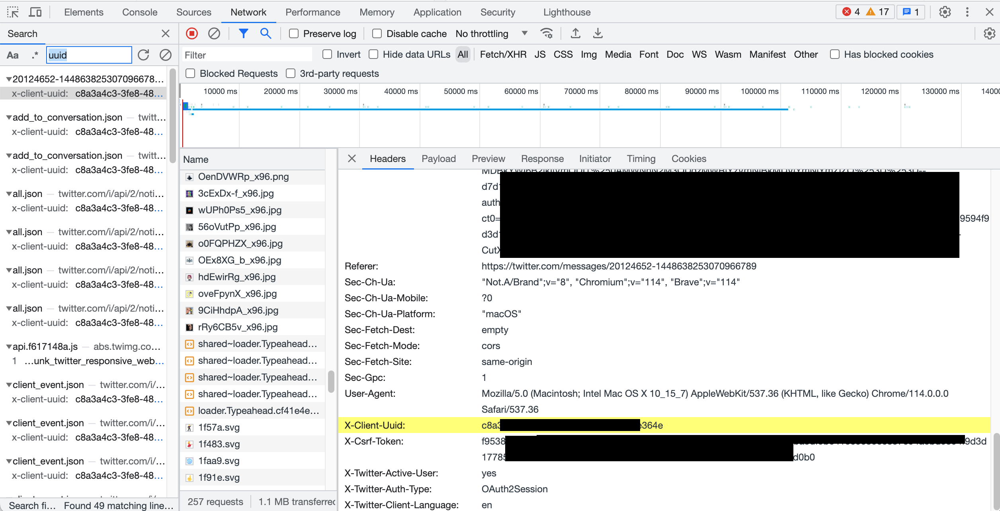

# Notarize Twitter DMs

The `twtter_dm.rs` example sets up a TLS connection with Twitter and notarizes the requested DMs. The full received transcript is notarized in one commitment, so nothing is redacted. The result is written to a local JSON file (`twitter_dm.json`) for easier inspection.

This involves 3 steps:
1. Configure the inputs
2. Start the (local) notary server
3. Notarize

## Inputs

In `twtter_dm.rs`, you need to set the following constants:

| Name            | Example                                                 |
| --------------- | ------------------------------------------------------- |
| CONVERSATION_ID | `20124652-973145016511139841`                           |
| CLIENT_UUID     | `e6f00000-cccc-dddd-bbbb-eeeeeefaaa27`                  |
| AUTH_TOKEN      | `670ccccccbe2bbbbbbbc1025aaaaaafa55555551`              |
| ACCESS_TOKEN    | `AAAAAAAAAAAAAAAAAAAAANRILgAA...4puTs%3D1Zv7...WjCpTnA` |
| CSRF_TOKEN      | `77d8ef46bd57f722ea7e9f...f4235a713040bfcaac1cd6909`    |

You can obtain these parameters by opening [Twitter](https://twitter.com/messages/) in your browser and accessing the message history you want to notarize. Please note that notarizing only works for short transcripts at the moment, so choose a contact with a short history. The `CONVERSATION_ID` corresponds to the last part of the URL.

Next, open the **Developer Tools**, go to the **Network** tab, and refresh the page. Then, click on **Search** and type `uuid` as shown in the screenshot below:



Repeat the process for the other constants.

## Start the notary server

In the `tlsn\examples` folder, run the following command:

```sh
cargo run --release --example notary
```

The first time you run this command, it will download the dependencies and compile the Rust sources, so it might take a while.

You can use **Ctrl-C** to stop the server, when the notarization is ready.


## Notarize

In the tlsn\examples folder, run the following command:

```sh
RUST_LOG=debug,yamux=info cargo run --release --example twitter_dm
```

If everything goes well, you should see output similar to the following:

```log
   Compiling tlsn-examples v0.0.0 (/Users/heeckhau/tlsnotary/tlsn/tlsn/examples)
    Finished release [optimized] target(s) in 8.52s
     Running `/Users/heeckhau/tlsnotary/tlsn/tlsn/target/release/examples/twitter_dm`
Sending request
Sent request
Request OK
{
  "conversation_timeline": {
    "entries": [
      {
        "message": {
          "conversation_id": "20124652-45653288",
        ...
        "withheld_in_countries": []
      }
    }
  }
}
Notarization complete!
```

If the transcript was too long, you may encounter the following error:

```
thread 'tokio-runtime-worker' panicked at 'called `Result::unwrap()` on an `Err` value: IOError(Custom { kind: InvalidData, error: BackendError(DecryptionError("Other: KOSReceiverActor is not setup")) })', /Users/heeckhau/tlsnotary/tlsn/tlsn/tlsn-prover/src/lib.rs:173:50
```
